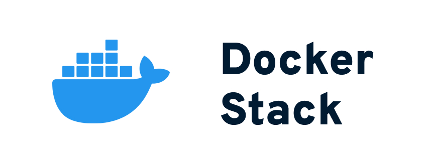

This repo contains a simple Docker setup you can drop into many PHP-based projects without the configuration and tweaking hassle. Find out more about the idea behind this [in my blog post](https://blog.kovah.de/en/5gw1x8-a-drop-in-docker-stack-for-php-app/).


## Basics

The stack consists of four files from those two are configuration files and one is the .env file you can find in many projects.

Directory structure
```
/
├─ docker
│  ├─ php.ini
│  └─ nginx.conf
├─ // Your other app files
├─ .env
└─ docker-compose.yml
```

My default setup consists of PHP, MariaDB as a MySQL-compatible database server, nginx and Redis. All services are defined in the `docker-compose.yml` file.

Part of the docker-compose
```
# --- PHP
php:
  container_name: "project-php"
  image: bitnami/php-fpm:8.0
  volumes:
    - .:/app:delegated
    - ./docker/php.ini:/opt/bitnami/php/etc/conf.d/php.ini:ro

# --- nginx
nginx:
  container_name: "project-nginx"
  image: bitnami/nginx:1.21
  ports:
    - "127.0.0.1:80:8085"
  depends_on:
    - php
  volumes:
    - .:/app:delegated
    - ./docker/nginx.conf:/opt/bitnami/nginx/conf/server_blocks/site.conf:ro
```

This is the definition of the PHP and nginx containers. As you can see it runs with PHP 8. The only things it does is to make the project available in the `/app` directory (the base directory for all Bitnami containers) and apply your custom php.ini.

### Current Service Versions

| Service  | Version  |
| -------- | -------- |
| PHP      | 8.0      |
| MariaDB  | 10.6     |
| nginx    | 1.21     |
| Redis    | 6.2      |


## Setup & Configuration

In most cases you only have to change the .env file because it contains variable details about the stack and passwords. The main stack works for all plain PHP projects, but you can easily make it work with Laravel or any CMS by changing the `nginx.conf` file because each system may has different requirements on the web server configuration.


## Installation and usage

* Copy the main files (everything except /public, /.github and README.md) to your project
* Make a copy of the `.env.example` file and name it `.env`, or copy the needed values to your existing .env file. Laravel users do not have to copy anything.
* Make sure the current configuration matches your project setup. CMS like Wordpress or Drupal need additional configuration.
* Replace `dockerstack` with your own project name in the `APP_NAME` variable in the .env file.
* Run `docker-compose up -d`.

Docker will then download all images and start them up. By default, port 80 on your host machine is bound to nginx, so you should be able to access your app by opening `http://localhost` in your browser.

The database is accessible from your local machine only via port 3306.


---

Docker Stack is a project by [Kovah](https://kovah.de) | [Contributors](https://github.com/Kovah/Docker-Stack/graphs/contributors)
